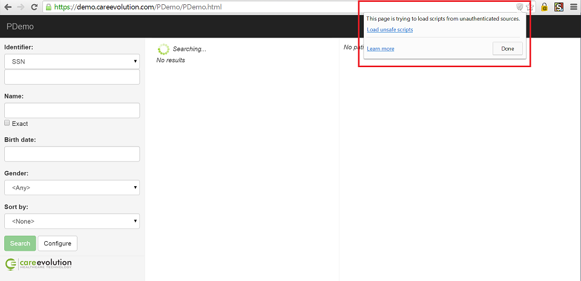
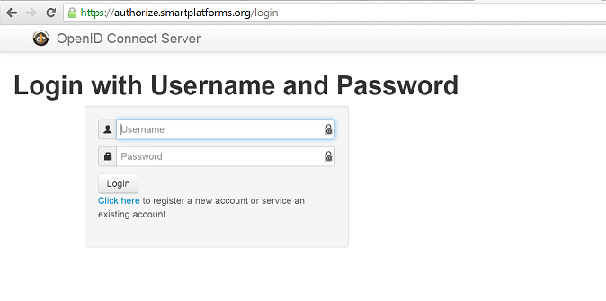
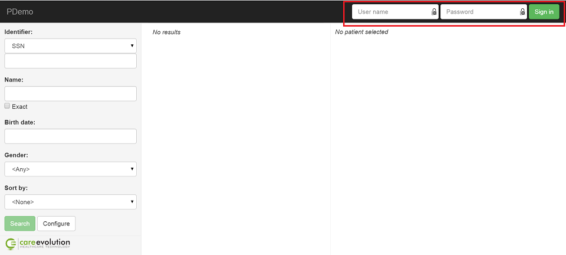
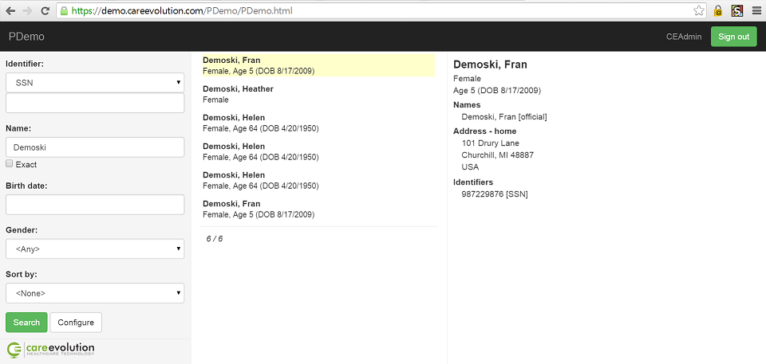
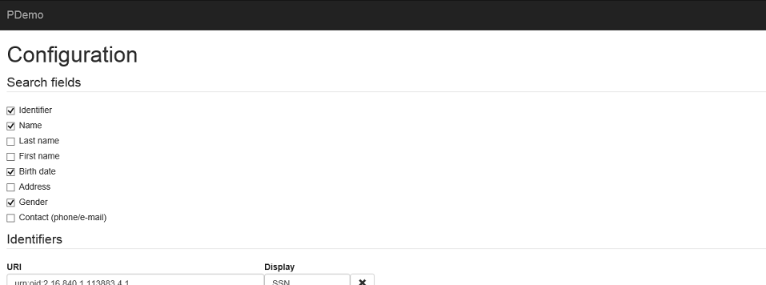

# PDemo

*[FHIR](http://www.hl7.org/implement/standards/fhir/)-based Patients' DEMOgraphics*

Simple HTML+JavaScript single page application that query patients' demographics information from a FHIR server.

It is a consumer implementation of the [IHE PDQm profile](http://www.ihe.net/uploadedFiles/Documents/ITI/IHE_ITI_Suppl_PDQm_Rev1.0_PC_2014-06-06.pdf).

## Basic usage  - no authentication

To start PDemo navigate with your browser to `PDemo.html?fhirServiceUrl=xxxxx`, where xxxx is the URL of the FHIR server to use. For example:

`https://demo.careevolution.com/PDemo/PDemo.html?fhirServiceUrl=https://fhir-open-api.smartplatforms.org`

starts PDemo connecting to the [SMART on FHIR](http://docs.smartplatforms.org/) demo anonymous server, and:

`https://demo.careevolution.com/PDemo/PDemo.html?fhirServiceUrl=http://spark.furore.com/fhir`

starts PDemo connecting to the [Furore](http://spark.furore.com/) demo server. 

When starting in this way the app does not use authentication, and so the FHIR server must accept anonymous (non authenticated) requests.

If `PDemo.html` is served using HTTPS and the FHIR server uses non-secure HTTP (as in the second example above) the browser will complain about 'mixed content' or 'unauthenticated sources' and it will be necessary to confirm that that is OK for the app to work:

In general `PDemo.html` will be hosted on a server different from the FHIR one, hence the FHIR server must support [CORS](http://en.wikipedia.org/wiki/Cross-origin_resource_sharing).

## Using SMART authentication

[SMART on FHIR](http://docs.smartplatforms.org/) is an extension of the FHIR API that defines an authentication protocol based on [OAuth2](http://oauth.net/2/).

To use SMART authentication specify the URL of the FHIR server using `iss` instead than `fhirServiceUrl`. For example:

`https://demo.careevolution.com/PDemo/PDemo.html?iss=https://fhir-api.smartplatforms.org`

starts PDemo connecting to the [SMART on FHIR](http://docs.smartplatforms.org/) demo authenticated server. 

When using the `iss` parameter PDemo follows the [SMART authorization sequence](http://docs.smartplatforms.org/authorization/public/), redirecting the browser to the login page associated with the FHIR server:

Once the user logs in and authorizes the app the browser redirects back to PDemo, that uses the user credentials to access the FHIR server.

PDemo is registered with the [authorization server](https://authorize.smartplatforms.org/) used by the SMART demo server. The registration includes the list of authorized startup URLs, so PDemo can be run only as `https://demo.careevolution.com/PDemo/PDemo.html` when accessing the SMART demo server. To run PDemo from another server it is necessary to create a new registration - and change its client ID to match the new registration. The client ID is in `PDemoConfiguration.js`

## Using login authentication

PDemo can login directly to a FHIR server that supports [OAuth2 password credentials grant](http://tools.ietf.org/html/rfc6749#section-4.3).

To use login authentication specify the URL of the FHIR server as in the 'no authentication case' and specify the OAuth2 password credential grant URL using the `tokenUrl` parameter:

`https://demo.careevolution.com/PDemo/PDemo.html?fhirServiceUrl=https://careev13:8080/fhir&tokenUrl=https://careev13:8080/OAuth2/Token`

PDemo displays an additional login form in the top right corner:

Entering user name and password and cliking on 'Sign in' sends the password credential grant request to the token URL (`https://careev13:8080/OAuth2/Token` in the example), if successful then PDemo uses those user credentials to access the FHIR server:

## Configuration

Various search and display options are configurable. This configuration is accessible using the 'Configure' button at the botton of the search form:

The current configuration is stored in the browser local storage, so it is preserved between session.

To reset the configuration to its default initial value add a `resetConfiguration` parameter to PDemo URL:

`https://demo.careevolution.com/PDemo/PDemo.html?resetConfiguration=`

## Dependencies

PDemo uses jQuery, AngularJS and Bootstrap - all loaded from CDN locations, so a working Internet connection is needed - even if the app and the FHIR server are local.

## Browsers compatibility

Tested (mostly) with IE 11 and Chrome. It should work on any modern browser.
